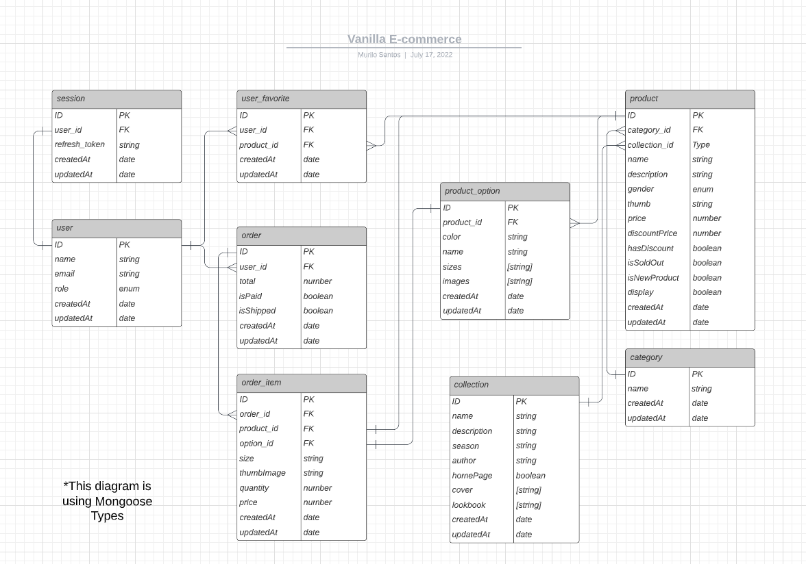

<h1>Vanilla E-commerce Server API</h1>

This is the backend of [Vanilla E-commerce](https://github.com/muhhx/Vanilla-Ecommerce-Frontend)

It's a RESTful API built with NodeJS + Express + MongoDB that receives, process and delivers all the data from the frontend through Restful APIs.

## About this Project

- **Live website:** <https://vanillaec.herokuapp.com/>
- **Frontend repository:** <https://github.com/muhhx/Vanilla-Ecommerce-Frontend/>

The idea of the app was to build a place to share and curate my clothing interests from different brands and collections, so I came to the conclusion that there was no better way than to create a fully functional e-commerce application 😅.

The project includes Authentication, Payment methods, a Theme switcher, and various other functionalities that enhance the user experience, integrating it into third-party services like AWS and Stripe.

I've also put a lot of time and effort into the admin page, creating an intuitive and straightforward administration panel to manage our products, categories, collections, and the whole website tbh.

Let's connect on LinkedIn: <https://www.linkedin.com/in/muhhx/>

Send me an email: muriloue@gmail.com

## Database diagram

<h4 align="center">
  
</h4>

## Public API endpoints
> BASE_URL = https://vanilla-ecommerce-backend.herokuapp.com/

- **Get all products**
> http://BASE_URL/api/product

| ENDPOINT | METHOD | Params | URL Params | Success Response | Error Response              |
| -------- | :----: | :----: | :--------: | ---------------- | --------------------------- |
| /product | GET    | -      | -          | **Code:** 200 - OK</br> **Content:** {</br>[[Product](#product)]</br>}          | 500 - INTERNAL SERVER ERROR |

- **Get a specific product**
> http://BASE_URL/api/product/:id

| ENDPOINT | METHOD | Params | URL Params | Success Response | Error Response              |
| -------- | :----: | :----: | :--------: | ---------------- | --------------------------- |
| /product/:id | GET    | -      | id          | **Code:** 200 - OK</br> **Content:** {</br>[Product](#product)</br>}          | 404 - NOT FOUND </br></br> or </br></br> 500 - INTERNAL SERVER ERROR |

- **Get all categories**
> http://BASE_URL/api/category

| ENDPOINT | METHOD | Params | URL Params | Success Response | Error Response              |
| -------- | :----: | :----: | :--------: | ---------------- | --------------------------- |
| /category | GET    | -      | -          | **Code:** 200 - OK</br> **Content:** {</br>[[Category](#category)]</br>}          | 500 - INTERNAL SERVER ERROR |

- **Get all collections**
> http://BASE_URL/api/collection

| ENDPOINT | METHOD | Params | URL Params | Success Response | Error Response              |
| -------- | :----: | :----: | :--------: | ---------------- | --------------------------- |
| /collection | GET    | -      | -          | **Code:** 200 - OK</br> **Content:** {</br>[[Collection](#collection)]</br>}          | 500 - INTERNAL SERVER ERROR |

## Authentication
- Talk about axios interceptors also

## Models
##### Image
- **Url:** Url of the image stored in AWS
- **Key:** Key of the image stored in AWS, so it can be deleted and manipulated

```
{
  "url": {
    "type": "String",
    "required": true
  },
  "key": {
    "type": "String",
    "required": true
  },
}
```

##### Category
- **Name:** Unique name of the category ("shoe", "jacket", etc)

```
{
  "name": {
    "type": "String",
    "required": true,
    "unique": true
  }
}
```

##### Collection
- **Name:** Name of the collection
- **Description:** Description about the collection
- **Season:** Season of the collection ("SS22022", "AW2021", etc)
- **Author:** Author of the collection
- **Cover:** Three image URLs that will be displayed at the home screen if the product id selected to be there
- **Lookbook:** Look book, containing images of the collection
- **HomePage:** Whether the collection should be displayed at the home screen or not

```
{
  "name": {
    "type": "String",
    "required": true
  },
  "description": {
    "type": "String",
    "required": true
  },
  "season": {
    "type": "String",
    "required": true
  },
  "author": {
    "type": "String",
    "required": true
  },
  "cover": {
    "type": "[String]",
    "required": true
  },
  "lookbook": {
    "type": "[Image]",
    "required": true,
  },
  "homePage": {
    "type": "Boolean",
    "default": false
  },
}
```

##### Option
- **Color:** Hex code of the option
- **Name:** Name of the color/option
- **Sizes:** Sizes available to this specific product option ("P", "M", "G", etc)
- **Images:** Images of this specific product option

```
{
  "color": {
    "type": "String",
    "required": true
  },
  "name": {
    "type": "String",
    "required": true
  },
  "sizes": {
    "type": "[String]",
    "required": true,
    "minLength": 1
  },
  images: {
    "type": "[Image]",
    "required": true,
    "minLength": 1,
  },
}
```

##### Product
- **Name:** Name of the product
- **Description:** A description about the product
- **Thumb:** A URL of some of the options' images to represent the product
- **Gender:** The gender of the product (it can also be "all") = ["all", "men"] or ["all", "woman"]
- **Options:** Options of this product
- **CategoryId:** Category of the product
- **CollectionId:** Collection of the product
- **Price:** Price of the product in cents (30000 = R$300,00)
- **DiscountPrice:** Discount price of the product in cents
- **hasDiscount:** indicates if the discountPrice should be available to the product
- **display:** indicates if the product should be displayed in the store
- **isSoldOut:** indicates if the product is sold out. If it is, you will not be able to add the product to the cart
- **isNewProduct:** indicates if the product is new

```
{
  "name": {
    "type": "String",
    "required": true,
  },
  "description": {
    "type": "String",
    "required": true
  },
  "thumb": {
    "type": "String",
    "required": true
  },
  "gender": {
    "type": "[String]",
    "required": true,
    "minLength": 1
  },
  "options": {
    "type": "[Option]",
    "required": true,
    "minLength": 1,
  }
  "categoryId": {
    "type": "String",
    "required": true
  },
  "collectionId": { 
    "type": "String",
    "required": true
  },
  "price": {
    "type": "Number",
    "required": true
  },
  "discountPrice": {
    "type": "Number",
    "default": 0 
  },
  "hasDiscount": {
    "type": "Boolean",
    "default": false
  },
  "display": {
    "type": "Boolean",
    "default": true
  },
  "isSoldOut": {
    "type": "Boolean", 
    "default": false
  },
  "isNewProduct": {
    "type": "Boolean",
    "default": true
  },
}
```

## Built with (server)

- [Typescript](https://www.typescriptlang.org/) | More transparency and control over the code
- [Node](https://nodejs.org/en/) | Build the server
- [Express](https://expressjs.com/) | Framework for Node
- [Bcrypt](https://www.npmjs.com/package/bcrypt) | Encrypt data
- [UUID](https://www.npmjs.com/package/uuid) | Generate unique ids
- [Dotenv](https://www.npmjs.com/package/dotenv) | Handle Environment variables
- [MongoDB](https://www.mongodb.com/) | Cloud Database
- [Mongoose](https://mongoosejs.com/docs/index.html) | Model the application
- [Multer](https://www.npmjs.com/package/multer) | File upload

## Support tools

- [AMAZON s3](https://aws.amazon.com/s3/) | Storage service
- [Stripe](https://stripe.com/en-br) | Payment services
- [JWT Tokens](https://jwt.io/) | Accesss and Refresh tokens for Auth, stored in httpOnly Cookie

**\*Note:** more tools and technologies were used in the client of this application, where you can check it [here](https://github.com/muhhx/Vanilla-Ecommerce-Frontend)\*

<h4 align="center">Murilo Santos, 2022.✨™</h4>
